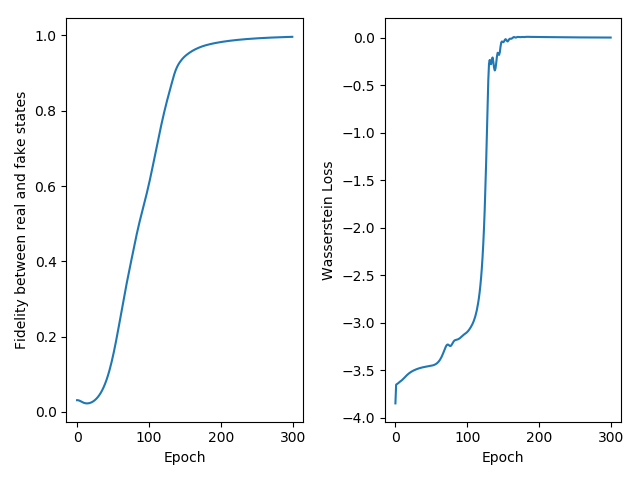

### using qWGAN for Hamiltonian simulation

Here we use our qWGAN for Hamiltonian simulation. As an example, you can find the settings in configuration file config_hs.py

#### Preparation

1. We consider an one-dimensional nearest-neighbor Heisenberg model with a random magnetic field in the z direction. 
``` python
target_unitary = scio.loadmat('./exp_ideal_{}_qubit.mat'.format(cf.system_size))['exp_ideal']
real_state_tmp = np.matmul(np.kron(target_unitary, Identity(cf.system_size)), input_state)
real_state = real_state_tmp
```
2. Define the Generator and Discriminator
* Create the instance of generator
```python
gen = Generator(cf.system_size)
```
* Construct and set the quantum circuit as the generator
``` python
gen.set_qcircuit(construct_qcircuit(gen.qc, cf.system_size, cf.layer))
```
* Create the instance of Discriminator
here we first define the four fixed Hermitian matrix
``` python
herm = [I, X, Y, Z]
dis = Discriminator(herm, cf.system_size*2)
```

#### Training
Alternately update the parameters of Generator and Discriminator until the fidelity between the generated quantum state and target state converges to 1.
``` python
gen.update_gen(dis,real_state)
```
``` python
dis.update_dis(gen,real_state)
```

#### Save the model and plot the figure
After training, we can also save the generator and discriminator by
``` python
save_model(gen, cf.model_gen_path)
save_model(dis, cf.model_gen_path)
```
and plot the loss and fidelity curve by 
``` python
plt_fidelity_vs_iter(fidelities, losses, cf)
```

#### Output
the fidelity curve and loss curve of 3 qubits Hamiltonian Simulation task

