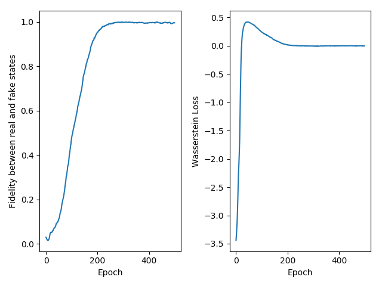

### learning the pure state by noise qWGAN

Here we provided the way to learn the pure state by qWGAN framwork with noise. As an example, you can find the settings in configuration file config_noise.py

#### Preparation

1. Create a random pure quantum state target state. Here we set the system size to 4.
``` python
angle = np.random.randint(1,10,size=[cf.system_size,3])
matrix = Identity(cf.system_size)
for j in range(cf.system_size):
    row_i_mat = np.matmul(Z_Rotation(cf.system_size, j, np.pi * angle[j][2], False),
                              np.matmul(Y_Rotation(cf.system_size, j, np.pi * angle[j][1], False),
                                        X_Rotation(cf.system_size, j, np.pi * angle[j][0], False)))
    matrix = np.matmul(row_i_mat, matrix)

param = np.random.rand(6)
XX1 = XX_Rotation(cf.system_size, 0, 1, param[0], False)
XX2 = XX_Rotation(cf.system_size, 0, 2, param[1], False)
XX3 = XX_Rotation(cf.system_size, 0, 3, param[2], False)
XX4 = XX_Rotation(cf.system_size, 1, 2, param[3], False)
XX5 = XX_Rotation(cf.system_size, 1, 3, param[4], False)
XX6 = XX_Rotation(cf.system_size, 2, 3, param[5], False)

zero_state = get_zero_state(cf.system_size)

real_state_tmp = np.matmul(XX6 ,np.matmul( XX5 ,np.matmul( XX4 ,np.matmul( XX3 ,np.matmul(XX2 , np.matmul(XX1 ,np.matmul( matrix , zero_state)))))))
real_state = np.matmul(real_state_tmp , real_state_tmp.getH())
```
2. Define the Generator and Discriminator
* Create the instance of generator
```python
gen = Gen(cf.system_size, cf.num_to_mix, cf.mu, cf.sigma)
```
where the cf.mu and cf.sigma is the parameters of the gaussian noise added to gradients.
* Construct and set the quantum circuit as the generator
``` python
gen.set_qcircuit(construct_qcircuit(qc_list_gen))
```
* Create the instance of Discriminator
here we first define the four fixed Hermitian matrix
``` python
herm = [I, X, Y, Z]
dis = Dis(herm, cf.system_size, cf.mu,cf.sigma)
```

#### Training
Alternately update the parameters of Generator and Discriminator until the fidelity between the generated quantum state and target state converges to 1.
``` python
gen.update_gen(dis,real_state)
```
``` python
dis.update_dis(gen,real_state)
```

#### Save the model and plot the figure
After training, we can also save the generator and discriminator by
``` python
save_model(gen, cf.model_gen_path)
save_model(dis, cf.model_gen_path)
```
and plot the loss and fidelity curve by 
``` python
plt_fidelity_vs_iter(fidelities, losses, cf)
```

#### Output
the fidelity curve and loss curve of 4 qubits pure state learning task with noise 

